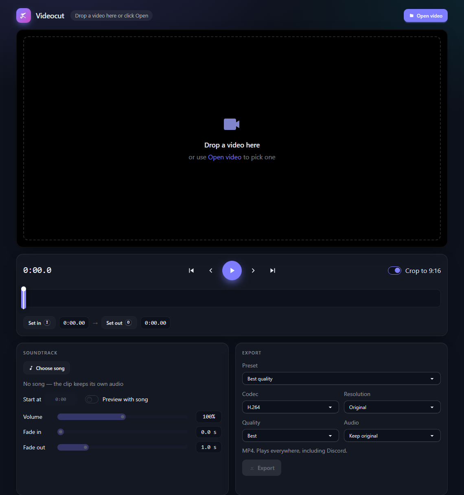

<div align="center">

# ✂️ Videocut

**Turn a landscape clip into a TikTok-ready 9:16 video — cut it, crop it, score it.**




</div>

---

## ✨ What it does

Videocut is a small local desktop app for one job: take **one 16:9 clip** and produce a **vertical 9:16 video** without losing visible quality.

| Step | What you do |
|---|---|
| 🎬 **Cut** | Set in/out points on the timeline. That range becomes the output. |
| 📐 **Crop** | Drag a 9:16 window across the 16:9 frame to pick what stays in shot. |
| 🎵 **Score** | Replace the audio with a song, pick where it starts on a waveform, set volume and fades. |
| 📦 **Export** | Pick a preset (or tune codec, resolution, quality, audio) and hit Export. |

## 🚀 Features

- 🖱️ **Drag & drop** a video onto the window, or use **Open video**
- 🔲 **Draggable 9:16 crop window** over a live preview, output scaled to 1080×1920 (Lanczos)
- ⏱️ **Frame-accurate cuts** with in/out handles and keyboard shortcuts
- 🌊 **Waveform start picker**: drag a window over the whole song to choose the section that plays
- 🔊 **Soundtrack controls**: volume 0–200% (with a limiter above 100%), fade in, fade out
- 🎧 **Preview with song**: hear the soundtrack against the clip before exporting
- 🎛️ **Export presets** for quality, Discord and small files, plus four independent menus
- 📊 **Progress bar and Cancel** (cancelling deletes the partial file)
- 🪄 **Automatic proxy** when the webview can't play a clip (e.g. HEVC); export always reads the original
- 🌙 Dark UI built with Tailwind + daisyUI

## ⌨️ Shortcuts

| Key | Action |
|---|---|
| `Space` | Play / pause |
| `←` / `→` | Previous / next frame (`Shift` = 1 second) |
| `I` | Set in point |
| `O` | Set out point |

## 📦 Export options

| Menu | Choices |
|---|---|
| **Codec** | H.264 (MP4) · H.265 (MP4) · AV1 (MP4) · VP9 (WebM + Opus) |
| **Resolution** | Original (1080×1920 when cropped) · 1080p · 720p · 480p |
| **Quality** | Best · High · Balanced · Small (constant quality) — or a target size: ≈10 / 25 / 50 MB |
| **Audio** | Keep original · AAC 256 / 128 / 96 kbps · Remove audio |

| Preset | Codec | Resolution | Quality | Audio |
|---|---|---|---|---|
| 🏆 Best quality *(default)* | H.264 | Original | Best (CRF 15) | Keep |
| 💬 Discord (720p, small) | H.264 | 720p | Small | 96 kbps |
| 💬 Discord (under 10 MB) | H.264 | 720p | ≈ 10 MB | 96 kbps |
| 🤏 Smallest | H.265 | 720p | Small | 96 kbps |

> 💡 TikTok re-encodes uploads anyway, so the goal is *visually* lossless, not mathematically lossless.

## 🛠️ Getting started

### Prerequisites

- 🟢 [Node.js](https://nodejs.org/) (24 recommended)
- 🦀 [Rust](https://rustup.rs/) (1.90+) and the Visual Studio C++ Build Tools
- 🪟 WebView2 (ships with Windows 11)
- 🎞️ [FFmpeg](https://ffmpeg.org/) with `ffmpeg` and `ffprobe` on your `PATH` — *or* build the bundled variant below

### Run it

```bash
npm install
npm run tauri dev
```

### Build it

```bash
npm run tauri build
```

### 🎁 Bundled FFmpeg build (no FFmpeg install needed)

A `bundled` cargo feature embeds zstd-compressed `ffmpeg` and `ffprobe` in the executable and unpacks them to `%LOCALAPPDATA%` on first use.

1. Put the binaries in `src-tauri/binaries/` (git-ignored):
   - `ffmpeg-x86_64-pc-windows-msvc.exe`
   - `ffprobe-x86_64-pc-windows-msvc.exe`
2. Build with the feature enabled:

```bash
npm run tauri build -- --features bundled
```

### 🧪 Tests

```bash
npm test
```

Vitest covers the pure logic: crop and time math, the ffmpeg argument builder, soundtrack filters, waveform helpers and path handling.

## 🧱 How it works

```
videocut/
├── index.html              single-screen UI
├── src/
│   ├── main.ts             wires UI to state
│   ├── lib/                pure, tested logic
│   │   ├── buildCommand.ts   state → ffmpeg arguments
│   │   ├── geometry.ts       crop window math
│   │   ├── presets.ts        codecs, qualities, presets
│   │   ├── songMix.ts        volume + fade filters
│   │   └── waveform.ts       peaks and song-start math
│   └── ui/                 player, timeline, crop overlay, waveform
└── src-tauri/src/
    ├── ffmpeg.rs           spawn, progress parsing, cancel
    ├── probe.rs            ffprobe wrapper
    └── lib.rs              Tauri commands
```

- 🧮 All crop, time and filter math lives in TypeScript and is unit tested without ffmpeg.
- 🦀 Rust only spawns processes and streams a `progress` event; it holds no media logic.
- 🎞️ Export is a single ffmpeg invocation. Simplified, for H.264 Best quality with a song:

```
ffmpeg -y -ss {in} -i clip.mp4 -ss {songStart} -i song.mp3
  -map 0:v:0 -map 1:a:0
  -vf "crop={cw}:{ih}:{x}:0,scale=1080:1920:flags=lanczos,setsar=1"
  -c:v libx264 -crf 15 -preset slow -pix_fmt yuv420p
  -c:a aac -b:a 256k -af "volume/afade filters from the soundtrack sliders"
  -t {dur} -movflags +faststart out.mp4
```

Full design notes live in [`docs/superpowers/specs`](docs/superpowers/specs).

## 🚧 Limitations

- One clip at a time
- Windows only, no installer or auto-update
- Sources must be wider than 9:16
- If the song is shorter than the selected range, the export is capped to the song length
- Volume above 100% applies to the export only; the preview caps at 100%

## 🧰 Tech stack

[Tauri 2](https://tauri.app/) · [Rust](https://www.rust-lang.org/) · [Vite](https://vite.dev/) · [TypeScript](https://www.typescriptlang.org/) · [Tailwind CSS 4](https://tailwindcss.com/) · [daisyUI](https://daisyui.com/) · [Vitest](https://vitest.dev/) · [FFmpeg](https://ffmpeg.org/)
